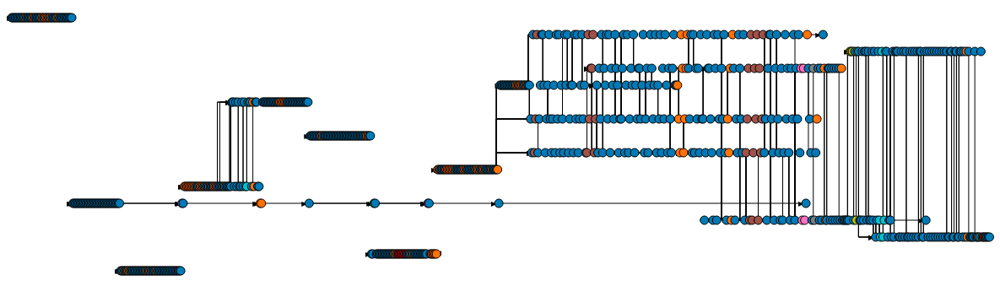
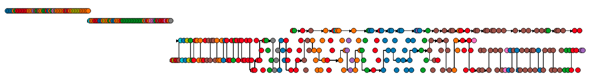
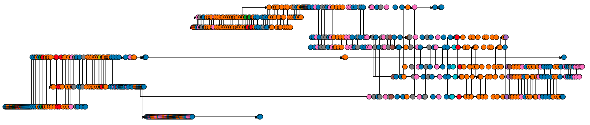
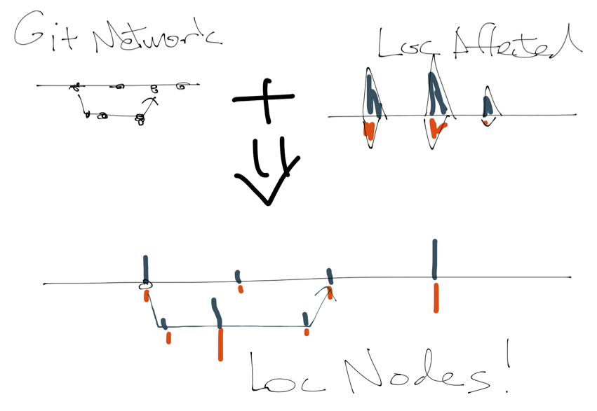
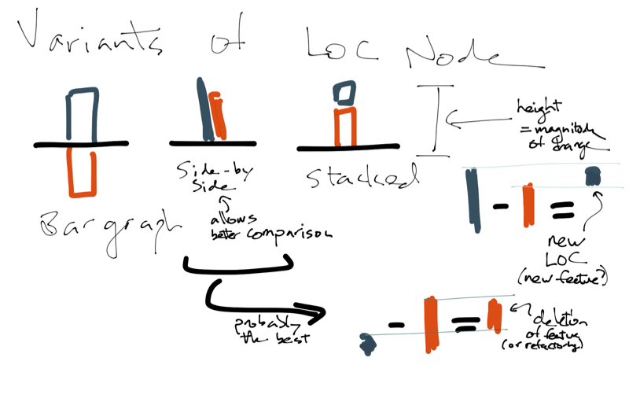
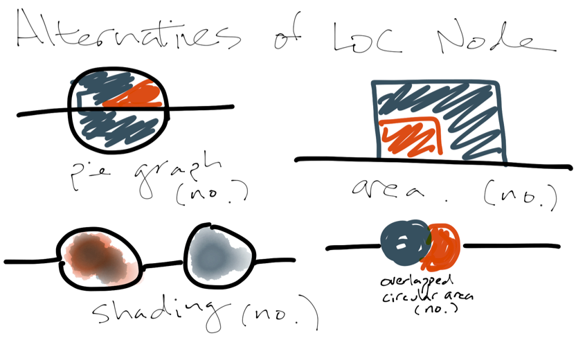
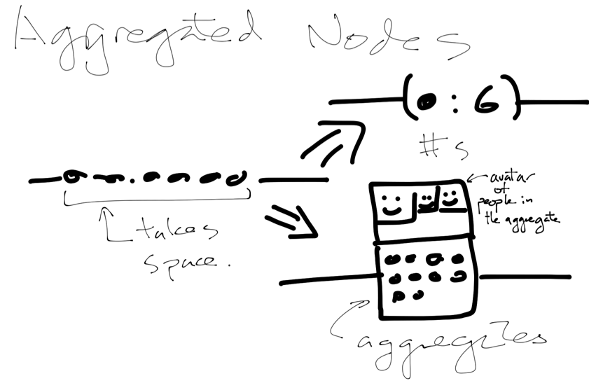
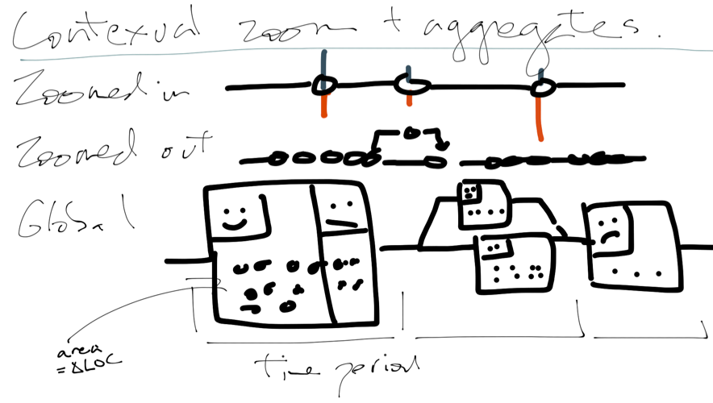

#Problem 3

_Given your previous design critiques, your experience with the previous graph visualization implementation and the reading of the article cited below (Lee et al., 2006), answer the following questions:_

---

1) __Which graph-related tasks does an ideal GitHub Network Graph need to address?__

Quite a few network-related tasks could be accomplished using the github network:

**Adjacency** gives the user the information about the preceding commits prior to modification, as well as what two commits were merged to form the child document.

**Following the path**, which is a series of adjacency tasks, will allow the user to follow the "lineage" of a document through a series of commits.

One can **"revisit"** a commit to trace where certain changes came from, or find the series of task-specific changes through looking at branches.

For higher-level task, one can observe how the project branches have **evolved over time** by following the network horizontally (along the time axis).

---
2) __Get back to the GitHub network visualization you implemented and test it with the following projects on GitHub: D3, jQuery and Bootstrap. There's a lot more data, but the interaction patterns of users are also very different. What do you notice about the three repositories?__

#### D3 
 

In **D3**, there is a single long strand, as well as concentrated branches at the end, which may indicate the changes in the level of activity to the repository.  Also, there are relatively fewer users involved compared other two repos.

#### Jquery

In **jquery**, there is a single strand of sparsely interconnected branches, where certain users dominate a time range (there is a "band" of commits by a user).  This may be more of a maintenance or minor improvement commits, where there is not large addition of features, and may reflect a highly mature nature of the library.  Quite a few users contribute to the library.

#### Bootstrap

In **bootstrap**, there are sevral pairs of tightly interwoven branches which covers a definite time period.  This may indicate task specific branches, with a certain goal, such as working toward a release.  It also seems that there are same mix of people involved in each strand, which may indicate that they are working as a close knit team.

---

3) __How does this impact your graph?__

Branch patterns are very organized in **bootstrap**, so it is not very difficult to follow - the existing visualizaton works well for that purpose.

**Jquery** has very disjointed network, with many singletons.  The "bands" of authors are the most useful pattern to glean informations of individual activities.

**D3** has many branches that are highly connected to each other and the branched visualization is not very effective.  It may be better to follow the sequential merges rather than the branches to get useful information from it.

---

4) __How would you improve your visualization to address issues with the larger and more complex data?__

I find that the branches are often not the most useful categorization to see the history of edits more clearly (an exception would be things like bootstrap, where each release is well organized).  

For more "organic" projects like D3, an obvious way to improve the visualization may be to allow filtering of information - one way may be to create a path between two commits and show the merges that were involved between the two to prevent the "chutes and ladders" effect where users need to follow a mazelike network to get some answers.

---

# Sketch Note (LOC-Node)

The magnitude of changes in code can sometimes be measured by the lines of code (LOC) influenced by the commit.  For example, a simple bug fix may only be one or two lines of change, whereas a new feature (or deletion of feature) could influence thousands of lines.  Since LOC affected by a commit can be a useful measure, it may be helpful to have this directly on the nodes to show the magnitude of the changes for a single commit.  **Barchart** is a good way to indicate the magnitude, as well as two color side-by-side/ bars are useful to indicate types of change (insertion and deletion) and comparisons of the categories (how much insertion vs deletion).  Other ideas was proposed but seemed to be either extraneous or too complicated to understand, and were discarded.

