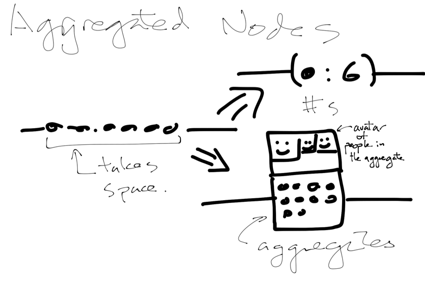

# Sketch Note (LOC-Node)

The magnitude of changes in code can sometimes be measured by the lines of code (LOC) influenced by the commit.  For example, a simple bug fix may only be one or two lines of change, whereas a new feature (or deletion of feature) could influence thousands of lines.  Since LOC affected by a commit can be a useful measure, it may be helpful to have this directly on the nodes to show the magnitude of the changes for a single commit.  **Barchart** is a good way to indicate the magnitude, as well as two color side-by-side/ bars are useful to indicate types of change (insertion and deletion) and comparisons of the categories (how much insertion vs deletion).  Other ideas was proposed but seemed to be either extraneous or too complicated to understand, and were discarded.

